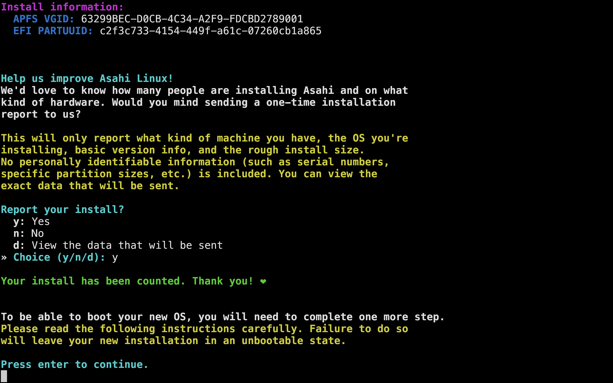

Asahi Linux is a project aimed at developing a Linux distribution for Apple Silicon Macs. The name "Asahi" comes from the Japanese word for "rising sun," symbolizing a new dawn for Linux on Apple hardware. The project focuses on making Linux run smoothly on Apple's ARM-based processors, such as the M1, M1 Pro, M1 Max, and M1 Ultra chips.

# images

 

Key Features of Asahi Linux:
1. Compatibility with Apple Silicon: Asahi Linux is designed to run on Apple Silicon Macs, taking full advantage of the performance and power efficiency of Apple's custom ARM architecture.
2. Open Source: The project is open source, allowing the community to contribute to its development and improve compatibility and performance.
3. Full Linux Experience: Asahi Linux aims to provide a full Linux experience on Apple Silicon Macs, including support for various Linux applications and utilities.
4. Active Development: The project is actively developed, with ongoing work to support more features and hardware components of Apple Silicon Macs.

## Pros:

Installation is smooth.
Battery usage is actually better than expected.
It’s faster than macOs. When I open any application or run any commands on kitty it’s significantly faster than mac.

## Problems that I’ve faced:

I3 is not supported. I tried but it didn’t boot. But it is perfectly  compatible with hyperland.
Screensharing problem:
The system crashed when I started to screen share in google meet. I tried to close the lid and open but it didn’t work. I had to wait for a while and hold the power button to restart the system.

# video

Asahi Linux represents a significant effort to bring the flexibility and power of Linux to the advanced hardware of Apple Silicon Macs, providing an exciting new option for Linux enthusiasts and developers.
