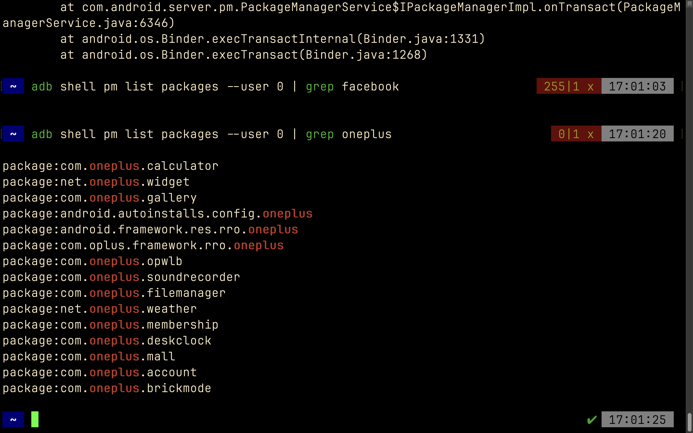
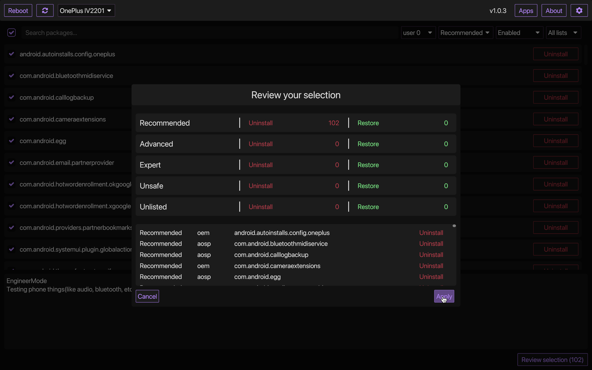
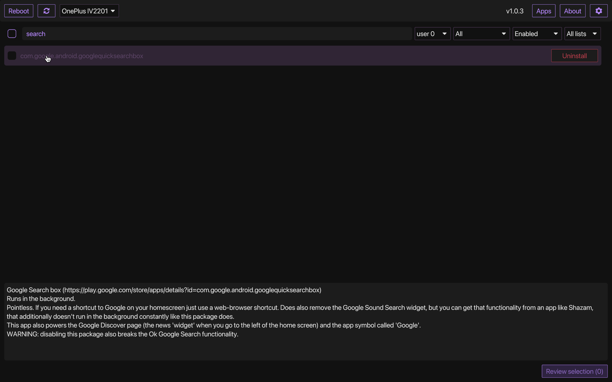
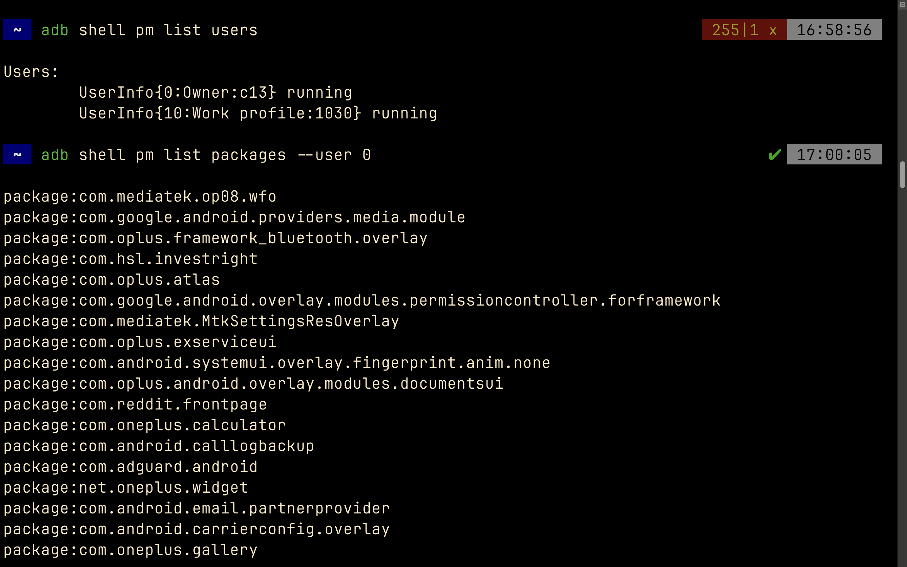

I came across universal-android-debloater in github. 

Android debloat refers to the process of removing or disabling unnecessary pre-installed applications (often called bloatware) that come with Android devices. These pre-installed apps are usually added by the device manufacturer. Bloatware can consume system resources such as storage, memory, and battery, and in some cases, can affect the performance of the device. 
So basically, this application aims to improve the overall performance and user experience by getting rid of these unwanted apps.

I’ve installed the app using homebrew. 

brew install android-platform-tools

Then connected my android phone using USB C to my mac & you can run the application to get GUI and the usage is self explanatory.
But if you want to analyse there are many adb commands(use adb help command). You can search and find out a command for every usecase.

## Here are some commands

== Adb Server
adb kill-server
adb start-server 

== Adb Reboot
adb reboot
adb reboot recovery 
adb reboot-bootloader
adb root //restarts adb with root permissions

== Shell
adb shell    // Open or run commands in a terminal on the host Android device.

== Devices
adb usb
adb devices   //show devices attached
adb devices -l //devices (product/model)
adb connect ip_address_of_device

== Get device android version
adb shell getprop ro.build.version.release 

== LogCat
adb logcat
adb logcat -c // clear // The parameter -c will clear the current logs on the device.
adb logcat -d > [path_to_file] // Save the logcat output to a file on the local system.
adb bugreport > [path_to_file] // Will dump the whole device information like dumpstate, dumpsys and logcat output.

== Files
adb push [source] [destination]    // Copy files from your computer to your phone.
adb pull [device file location] [local file location] // Copy files from your phone to your computer.

== App install
adb -e install path/to/app.apk

-d                        - directs command to the only connected USB device...
-e                        - directs command to the only running emulator...
-s <serial number>        ...
-p <product name or path> ...
The flag you decide to use has to come before the actual adb command:

adb devices | tail -n +2 | cut -sf 1 | xargs -IX adb -s X install -r com.myAppPackage // Install the given app on all connected devices.

== Uninstalling app from device
adb uninstall com.myAppPackage
adb uninstall <app .apk name>
adb uninstall -k <app .apk name> -> "Uninstall .apk withour deleting data"

adb shell pm uninstall com.example.MyApp
adb shell pm clear [package] // Deletes all data associated with a package.

adb devices | tail -n +2 | cut -sf 1 | xargs -IX adb -s X uninstall com.myAppPackage //Uninstall the given app from all connected devices

== Update app
adb install -r yourApp.apk  //  -r means re-install the app and keep its data on the device.
adb install –k <.apk file path on computer> 

== Home button
adb shell am start -W -c android.intent.category.HOME -a android.intent.action.MAIN

== Activity Manager
adb shell am start -a android.intent.action.VIEW
adb shell am broadcast -a 'my_action'

adb shell am start -a android.intent.action.CALL -d tel:+972527300294 // Make a call

// Open send sms screen with phone number and the message:
adb shell am start -a android.intent.action.SENDTO -d sms:+972527300294   --es  sms_body "Test --ez exit_on_sent false

// Reset permissions
adb shell pm reset-permissions -p your.app.package 
adb shell pm grant [packageName] [ Permission]  // Grant a permission to an app. 
adb shell pm revoke [packageName] [ Permission]   // Revoke a permission from an app.

// Emulate device
adb shell wm size 2048x1536
adb shell wm density 288
// And reset to default
adb shell wm size reset
adb shell wm density reset

== Print text
adb shell input text 'Wow, it so cool feature'

== Screenshot
adb shell screencap -p /sdcard/screenshot.png

$ adb shell
shell@ $ screencap /sdcard/screen.png
shell@ $ exit
$ adb pull /sdcard/screen.png

---
adb shell screenrecord /sdcard/NotAbleToLogin.mp4

$ adb shell
shell@ $ screenrecord --verbose /sdcard/demo.mp4
(press Control + C to stop)
shell@ $ exit
$ adb pull /sdcard/demo.mp4

## images

It’ll give you the descrption of the app and why should you delete the app. 
I’ve deleted almost all the recommended apps to remove bloatware. Needless to say it’s best not to delete the apps listed under unsafe and expert.
Have fun with the application and enjoy a sleek android experience. 
